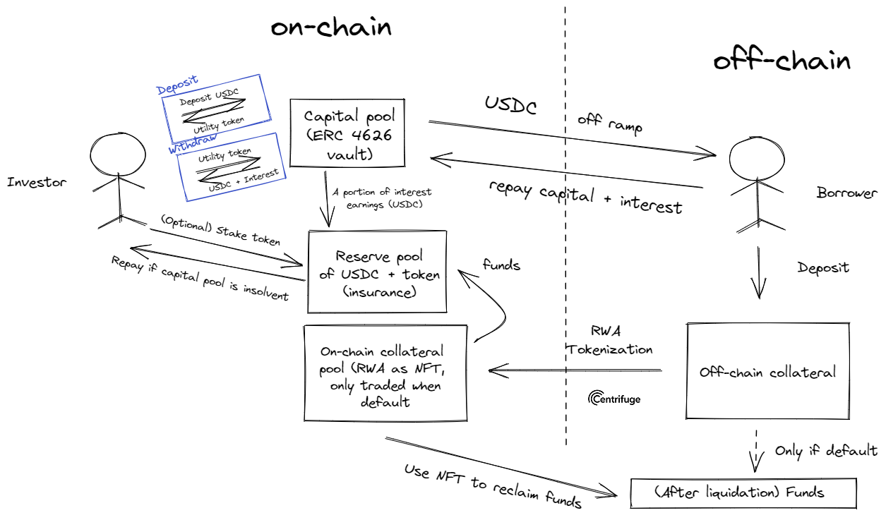
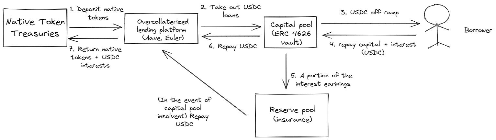
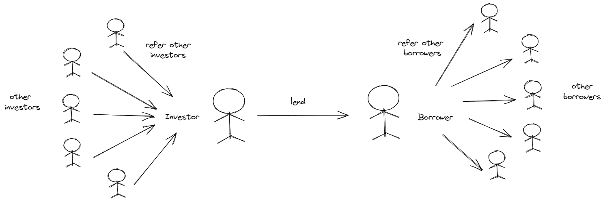

# defi-lending

### Architecture

The architecture to unlock capital in DeFi to fund off-chain borrowers is as follows:

The flow is summarized as follows:
1. Users deposit their USDC to the capital pool in return for interest bearing utility tokens. The USDC is locked for the period of the loan. 
2. Users can decide to stake their tokens in the reserve pool for higher interest return.
2. Once the quorum of the loan deal is achieved, the deposited USDC is lended to the borrower. If quorum is not achieved within the target date, users are free to withdraw their USDC.
3. The borrower periodically repays a portion of the loan amount together with the associated interests to the capital pool.
4. At the end of the loan period, users are able to withdraw their USDC and the interests by turning in the interest bearing tokens. 
5. In the event of a default, the reserve pool will cover the bad debt and repay the lenders. Users who staked their tokens in the reserve pool will be slashed. 

### Tapping Into Native Token Treasuries

We believe that DAOs and DeFi protocols are in a good position to diversify their portfolio while creating impact in the real world. Therefore, we also offer an alternative for DAOs and DeFi protocols to lend in their native tokens. The flow of lending with the native tokens is as follows: 

The entire flow will be handled by our platform, through smart contracts. [INSERT MORE]

### Building a Trust-enabled Ecosystem

We believe creating a network of trustworthy borrowers is essential in attracting liquidity in DeFi. When a new investor lends to a new borrower and repayment is done successfully, both  the investor and the borrower receives a dynamic NFT to represent the established trust connection. The investor is able to invite other investors to the ecosystem, where each of them will be issued a dynamic NFT too to represent the connection with the referrer. Similarly, the borrower is able to invite other borrowers too. Eventually, the trust graph will be incrementally built out where investors could see their degree of separations from a borrower. 

We are currently mapping out the incentives for investors and borrowers to invite other users on our platform. In the longer term, our vision is to leverage lending activities to unlock a rich ecosystem of trust between investors and borrowers. The graph is stored in Filecoin.

#### External Integrations

1. [Aave](https://aave.com/) - Take out overcollaterized loans in Aave when native tokens are deposited in the capital pool
2. [Filecoin](https://filecoin.io/) - Storage for trust graph which acts as the reference points for lenders to determine trustworthiness of borrowers
